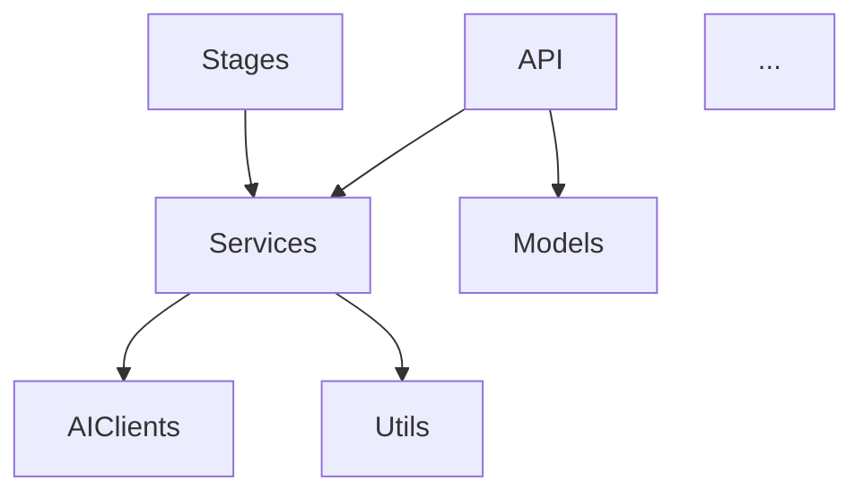

# Architecture Audit Workflow

> Глубокий анализ архитектуры для выявления возможностей улучшения.

---

## Когда применять

| Ситуация | Признаки |
|----------|----------|
| Проект в "неопределённом состоянии" | Быстрая разработка без рефлексии, "работает — не трогай" |
| Накопился техдолг | Дублирование, костыли, "временные" решения |
| Перед крупным рефакторингом | Нужно понять масштаб изменений |
| Периодически | Раз в квартал, после major release |

---

## Отличие от других процессов

| Процесс | Направление | Вопрос |
|---------|-------------|--------|
| **arch-audit** | Код → Инсайты | "Как улучшить архитектуру?" |
| **arch-checker** | ADR → Код | "Соответствует ли код решениям?" |
| **baseline-audit** | Код ↔ Docs | "Актуальна ли документация?" |

**arch-audit** — это Architecture Discovery: ревью с чистого листа, не проверка соответствия.

---

## Стратегия работы с контекстом

> [!warning] Ограничение контекста
> Весь код проекта не помещается в одну сессию. Используем промежуточные артефакты и разбивку по областям.

### Принципы

1. **Метаданные перед содержимым** — сначала структура, потом код
2. **По областям** — одна папка/модуль за сессию
3. **Промежуточные артефакты** — findings сохраняются между сессиями
4. **Синтез из артефактов** — финальный анализ читает findings, не код

### Структура артефактов

```
docs/audit/arch-audit-YYYY-MM-DD/
├── system-map.md           # Этап 1: карта системы
├── findings-stages.md      # Этап 2: анализ по областям
├── findings-services.md    
├── findings-api.md         
├── findings-utils.md       
├── findings-models.md      
├── patterns-analysis.md    # Этап 3: паттерны
├── proposals.md            # Этап 4: предложения
└── roadmap.md              # Этап 5: план

→ Финальный отчёт: docs/audit/arch-audit-YYYY-MM-DD.md
```

---

## Обзор процесса

```
┌─────────────────────────────────────────────────────────────────┐
│                    ARCHITECTURE AUDIT                           │
├─────────────────────────────────────────────────────────────────┤
│                                                                 │
│  Этап 1: OVERVIEW (1 сессия)                                    │
│  ├─ Структура проекта (tree)                                    │
│  ├─ Точки входа (__init__.py, imports)                          │
│  └─ Граф зависимостей между модулями                            │
│      ↓                                                          │
│      system-map.md                                              │
│                                                                 │
│  Этап 2: DEEP DIVE (4-6 сессий)                                 │
│  ├─ services/stages/                                            │
│  ├─ services/ (остальное)                                       │
│  ├─ api/                                                        │
│  ├─ utils/                                                      │
│  └─ models/, config/                                            │
│      ↓                                                          │
│      findings-*.md                                              │
│                                                                 │
│  Этап 3: PATTERNS (1 сессия)                                    │
│  ├─ Читает findings-*.md                                        │
│  ├─ Выявляет общие паттерны                                     │
│  └─ Определяет антипаттерны                                     │
│      ↓                                                          │
│      patterns-analysis.md                                       │
│                                                                 │
│  Этап 4: PROPOSALS (1 сессия)                                   │
│  ├─ Читает system-map + patterns                                │
│  ├─ Формирует предложения                                       │
│  └─ Оценивает impact                                            │
│      ↓                                                          │
│      proposals.md                                               │
│                                                                 │
│  Этап 5: ROADMAP (1 сессия)                                     │
│  ├─ Приоритизация                                               │
│  ├─ Зависимости между изменениями                               │
│  └─ Какие ADR создать                                           │
│      ↓                                                          │
│      roadmap.md → arch-audit-YYYY-MM-DD.md                      │
│                                                                 │
└─────────────────────────────────────────────────────────────────┘
```

---

## Этап 1: Overview

### Цель

Построить карту системы без погружения в детали реализации.

### Шаги

| Шаг | Что делаем | Результат |
|-----|------------|-----------|
| 1.1 | Структура проекта | Дерево папок |
| 1.2 | Точки входа | Экспорты из `__init__.py` |
| 1.3 | Граф зависимостей | Кто кого импортирует |

### Промпт: Шаг 1.1 — Структура

```
Построй карту структуры проекта.

## Задача
1. Выведи дерево backend/app/ (только папки и .py файлы)
2. Выведи дерево frontend/src/ (только папки)
3. Выведи дерево config/

## Формат
Просто tree, без содержимого файлов.
Отметь количество файлов в каждой папке.
```

### Промпт: Шаг 1.2 — Точки входа

```
Определи точки входа модулей.

## Задача
1. Прочитай backend/app/services/__init__.py
2. Прочитай backend/app/services/stages/__init__.py
3. Прочитай backend/app/services/ai_clients/__init__.py
4. Прочитай backend/app/api/__init__.py

## Формат
Для каждого модуля:
- Что экспортируется (public API)
- Что импортируется внутри
```

### Промпт: Шаг 1.3 — Граф зависимостей

````
Построй граф зависимостей между модулями.

## Задача
Для каждой папки в backend/app/:
- Какие другие папки она импортирует?
- Кто импортирует её?

## Формат
```
services/stages/ → services/, models/, utils/, config/
services/ → ai_clients/, models/, utils/
api/ → services/, models/
...
```

## Обрати внимание на
- Циклические зависимости
- Модули с максимальным количеством связей ("центры тяжести")
- Изолированные модули
````

### Артефакт: system-map.md

````markdown
---
doc_type: audit
status: draft
created: YYYY-MM-DD
---

# System Map

## Структура проекта

### backend/app/
```
api/           (5 файлов)
models/        (3 файла)
services/      (12 файлов)
  stages/      (10 файлов)
  ai_clients/  (4 файла)
  pipeline/    (5 файлов)
utils/         (8 файлов)
```

## Граф зависимостей



## Центры тяжести
- `services/` — максимальные входящие связи
- `models/schemas.py` — используется везде

## Потенциальные проблемы
- [ ] Циклическая зависимость: X ↔ Y
- [ ] Изолированный модуль: Z (не используется?)

## Контекст для следующей сессии
Начать Deep Dive с `services/stages/` — ядро pipeline логики.
````

---

## Этап 2: Deep Dive

### Цель

Детальный анализ каждой области кода.

### Разбивка по областям

| Сессия | Область | Файлов | Фокус анализа |
|--------|---------|--------|---------------|
| 2.1 | `services/stages/` | ~10 | Единообразие stages, BaseStage |
| 2.2 | `services/` (generators, extractors) | ~8 | Дублирование, SRP |
| 2.3 | `services/pipeline/` + `services/ai_clients/` | ~9 | Абстракции, связность |
| 2.4 | `api/` | ~5 | Консистентность, обработка ошибок |
| 2.5 | `utils/` | ~8 | Обобщение, переиспользование |
| 2.6 | `models/`, `config/` | ~5 | Структуры данных, конфигурация |

### Промпт: Deep Dive (универсальный)

```
Проведи архитектурный анализ области {AREA}.

## Контекст
Читай docs/audit/arch-audit-YYYY-MM-DD/system-map.md для общей картины.

## Задача
Прочитай все .py файлы в {PATH} и проанализируй:

### 1. Структура
- Какие классы/функции определены?
- Какие зависимости (imports)?

### 2. Паттерны
- Какие паттерны используются? (Factory, Strategy, etc.)
- Единообразие между файлами?

### 3. Потенциальные проблемы
- Дублирование кода между файлами?
- Нарушение Single Responsibility?
- Слишком длинные функции/классы?
- Hardcoded values?
- Отсутствующие абстракции?

### 4. Вопросы
- Что непонятно без дополнительного контекста?
- Что требует уточнения в других областях?

## Формат
Создай/обнови docs/audit/arch-audit-YYYY-MM-DD/findings-{area}.md
```

### Формат findings

````markdown
---
doc_type: audit
status: draft
area: services/stages
files_analyzed: 10
---

# Findings: services/stages/

## Обзор области

| Файл | Строк | Класс | Зависимости |
|------|-------|-------|-------------|
| parse_stage.py | 45 | ParseStage | parser, models |
| clean_stage.py | 120 | CleanStage | cleaner, ai_clients |
| ... | | | |

## Паттерны

### ✅ Хорошо
- Все stages наследуют BaseStage
- Единый интерфейс execute() → Result
- Чёткие depends_on

### ⚠️ Inconsistencies
- chunk_stage.py не использует should_skip(), хотя этап условный
- Разный стиль логирования: logger.info vs self.logger.info

## Потенциальные улучшения

### Дублирование
```python
# В 5 файлах повторяется:
usage = ChatUsage(input_tokens=..., output_tokens=...)
result.usage = usage
result.processing_time_ms = ...
```
→ Вынести в BaseStage или декоратор?

### Missing abstraction
- Нет общего способа добавить retry логику
- Каждый stage сам обрабатывает ошибки AI

### Hardcoded
- `max_retries = 3` в нескольких местах
- Timeout values разбросаны

## Вопросы для других областей
- [ ] summarizer.py vs summary_generator.py — в чём разница?
- [ ] Кто вызывает stages напрямую, минуя orchestrator?

## Контекст для следующей сессии
Следующая область: services/ (generators, extractors)
Проверить связь с findings этой сессии.
````

---

## Этап 3: Patterns

### Цель

Синтезировать findings в общие паттерны и антипаттерны.

### Что искать

| Категория | Примеры |
|-----------|---------|
| **Дублирование** | Копипаст между модулями, похожие функции |
| **God objects** | Классы/модули с 10+ ответственностями |
| **Tight coupling** | Модуль знает слишком много о других |
| **Leaky abstractions** | Детали реализации протекают наружу |
| **Missing abstractions** | Повторяющийся паттерн без обобщения |
| **Dead code** | Неиспользуемые функции, импорты |
| **Inconsistency** | Разные подходы к одной задаче |
| **Hardcoded values** | Магические числа, строки без констант |

### Промпт: Patterns

```
Проанализируй findings и выяви паттерны.

## Входные данные
Прочитай все findings-*.md в docs/audit/arch-audit-YYYY-MM-DD/

## Задача

### 1. Общие паттерны (хорошие)
Что используется консистентно и хорошо работает?

### 2. Антипаттерны
Что повторяется как проблема в нескольких областях?

### 3. Кросс-модульные проблемы
Проблемы на стыке модулей (из "вопросов" в findings)

### 4. Quick wins
Что можно исправить быстро с большим эффектом?

### 5. Системные проблемы
Что требует серьёзного рефакторинга?

## Формат
Создай docs/audit/arch-audit-YYYY-MM-DD/patterns-analysis.md
```

### Артефакт: patterns-analysis.md

```markdown
---
doc_type: audit
status: draft
---

# Patterns Analysis

## Хорошие паттерны

### Stage Abstraction
- BaseStage + StageRegistry работает
- Единый интерфейс, легко добавлять новые stages

### AI Client Protocol
- BaseAIClient protocol позволяет менять провайдеров
- Context profiles — гибкая настройка

## Антипаттерны

### 🔴 Дублирование метрик
**Где:** 6 из 10 stages, все generators
**Что:** Одинаковый код сбора usage/timing
**Impact:** Изменение формата метрик = правки в 10+ местах

### 🔴 Inconsistent error handling
**Где:** api/, stages/, services/
**Что:** Разные подходы к retry, разные исключения
**Impact:** Непредсказуемое поведение при ошибках

### 🟡 Hardcoded timeouts
**Где:** ai_clients/, stages/
**Что:** timeout=30, max_retries=3 разбросаны
**Impact:** Сложно настроить под разные окружения

## Кросс-модульные проблемы

### summarizer.py vs summary_generator.py
- Оба делают суммаризацию
- summary_generator используется в pipeline
- summarizer.py — legacy? мёртвый код?

### Прямые вызовы stages
- api/step_routes.py вызывает stages напрямую
- Дублирует часть логики orchestrator

## Матрица: Impact × Effort

| Проблема | Impact | Effort | Приоритет |
|----------|--------|--------|-----------|
| Дублирование метрик | High | Low | 🔴 Quick win |
| Error handling | High | Medium | 🔴 High |
| Hardcoded values | Medium | Low | 🟡 Medium |
| summarizer.py | Low | Low | 🟢 Low |
```

---

## Этап 4: Proposals

### Цель

Сформулировать конкретные предложения по улучшению.

### Промпт: Proposals

```
Сформулируй предложения по улучшению архитектуры.

## Входные данные
- docs/audit/arch-audit-YYYY-MM-DD/system-map.md
- docs/audit/arch-audit-YYYY-MM-DD/patterns-analysis.md

## Для каждой проблемы из patterns-analysis

### Формат предложения
1. **Проблема** — что не так (кратко)
2. **Предложение** — что сделать
3. **Изменения** — какие файлы/модули затронет
4. **Риски** — что может пойти не так
5. **Требует ADR?** — да/нет и почему

## Группировка
- Refactor (улучшение существующего)
- New abstraction (создание нового)
- Remove (удаление лишнего)
- Extract (вынос в отдельный модуль)

## Формат
Создай docs/audit/arch-audit-YYYY-MM-DD/proposals.md
```

### Артефакт: proposals.md

````markdown
---
doc_type: audit
status: draft
---

# Architecture Proposals

## P1: Metrics Collection Mixin

### Проблема
Дублирование кода сбора метрик в 10+ местах.

### Предложение
Создать `MetricsMixin` или декоратор `@collect_metrics`:

```python
class MetricsMixin:
    def collect_usage(self, usage: ChatUsage, start_time: float):
        self.result.usage = usage
        self.result.processing_time_ms = (time.time() - start_time) * 1000
```

### Изменения
- Создать: `utils/metrics.py`
- Изменить: все stages, все generators

### Риски
- Нужно аккуратно с наследованием (MRO)

### Требует ADR?
Нет — техническое улучшение, не архитектурное решение.

---

## P2: Unified Error Handling

### Проблема
Разные подходы к retry и обработке ошибок.

### Предложение
1. Создать иерархию исключений в `models/exceptions.py`
2. Создать retry decorator в `utils/retry.py`
3. Применить единообразно

### Изменения
- Создать: `models/exceptions.py`, `utils/retry.py`
- Изменить: ai_clients/, stages/, api/

### Риски
- Breaking change для существующих обработчиков ошибок
- Нужно обновить тесты

### Требует ADR?
**Да** — влияет на несколько модулей, меняет контракт ошибок.

---

## P3: Remove Dead Code

### Проблема
`summarizer.py` не используется (заменён на `summary_generator.py`).

### Предложение
Удалить `backend/app/services/summarizer.py`.

### Изменения
- Удалить: `summarizer.py`
- Проверить: нет ли импортов

### Риски
Минимальные — нужно только убедиться что не используется.

### Требует ADR?
Нет.

---

## Сводка

| ID | Proposal | Type | Effort | ADR? |
|----|----------|------|--------|------|
| P1 | Metrics Mixin | Extract | Low | No |
| P2 | Error Handling | New abstraction | Medium | Yes |
| P3 | Remove summarizer.py | Remove | Low | No |
| P4 | ... | | | |
````

---

## Этап 5: Roadmap

### Цель

Построить план реализации с учётом зависимостей.

### Промпт: Roadmap

```
Построй roadmap реализации предложений.

## Входные данные
docs/audit/arch-audit-YYYY-MM-DD/proposals.md

## Задача

### 1. Зависимости
Какие предложения зависят друг от друга?

### 2. Приоритизация
- Quick wins (low effort, high impact) — первые
- Фундаментальные изменения — после quick wins
- Nice to have — в конец

### 3. Группировка по релизам
Что можно сделать в одном PR/релизе?

### 4. ADR план
Какие ADR создать и в каком порядке?

## Формат
Создай docs/audit/arch-audit-YYYY-MM-DD/roadmap.md
```

### Артефакт: roadmap.md

````markdown
---
doc_type: audit
status: draft
---

# Architecture Roadmap

## Зависимости

```
P2 (Error Handling) ──┐
                      ├──► P1 (Metrics) можно независимо
P3 (Remove dead) ─────┘
```

## Фазы

### Фаза 1: Quick Wins (1-2 дня)

| # | Proposal | Effort | Блокирует |
|---|----------|--------|-----------|
| 1 | P3: Remove summarizer.py | 15 мин | — |
| 2 | P1: Metrics Mixin | 2-3 часа | — |

**Результат:** Меньше дублирования, чище код.

### Фаза 2: Error Handling (2-3 дня)

| # | Proposal | Effort | Блокирует |
|---|----------|--------|-----------|
| 1 | Создать ADR-014: Unified Errors | 1 час | P2 |
| 2 | P2: Implement error handling | 1-2 дня | — |

**Результат:** Предсказуемое поведение при ошибках.

### Фаза 3: Nice to Have

| # | Proposal | Effort |
|---|----------|--------|
| ... | ... | ... |

## ADR План

| ADR | Тема | Когда создать |
|-----|------|---------------|
| 014 | Unified Error Handling | Перед Фазой 2 |
| 015 | ... | ... |

## Метрики успеха

После реализации:
- [ ] Дублирование метрик: 10+ мест → 1 место
- [ ] Типы ошибок: разрозненные → единая иерархия
- [ ] Dead code: 0 неиспользуемых модулей
````

---

## Финализация

### Сборка итогового отчёта

```
Собери итоговый отчёт из промежуточных артефактов.

## Входные данные
Все файлы в docs/audit/arch-audit-YYYY-MM-DD/

## Формат
Создай docs/audit/arch-audit-YYYY-MM-DD.md со структурой:

1. Executive Summary (1 страница)
2. Ключевые findings
3. Топ-5 proposals
4. Roadmap (кратко)
5. Ссылки на детальные артефакты
```

### Артефакт: arch-audit-YYYY-MM-DD.md

```markdown
---
doc_type: audit
status: active
created: YYYY-MM-DD
updated: YYYY-MM-DD
version: vX.XX
tags:
  - audit
  - architecture
---

# Architecture Audit — YYYY-MM-DD

## Executive Summary

Проведён архитектурный аудит проекта bz2-video-transcriber.
Проанализировано X файлов в Y областях.

**Ключевые находки:**
- ✅ Stage abstraction работает хорошо
- ⚠️ Дублирование кода метрик в 10+ местах
- ⚠️ Inconsistent error handling
- 🔴 Dead code: summarizer.py

**Рекомендации:**
- 3 quick wins (1-2 дня)
- 1 новый ADR (error handling)
- Общий план: 1-2 недели

## Findings Summary

| Область | Статус | Основные проблемы |
|---------|--------|-------------------|
| stages/ | ✅ Good | Minor inconsistencies |
| services/ | ⚠️ | Дублирование, dead code |
| api/ | ⚠️ | Error handling |
| utils/ | ✅ Good | — |

## Top Proposals

1. **P1: Metrics Mixin** — Low effort, High impact
2. **P2: Error Handling** — Medium effort, High impact (требует ADR)
3. **P3: Remove dead code** — Low effort, Low impact

## Roadmap

- **Фаза 1** (Quick wins): P1, P3 — 1-2 дня
- **Фаза 2** (Error handling): P2 + ADR — 2-3 дня

## Детальные артефакты

- [System Map](arch-audit-YYYY-MM-DD/system-map.md)
- [Findings: stages](arch-audit-YYYY-MM-DD/findings-stages.md)
- [Patterns Analysis](arch-audit-YYYY-MM-DD/patterns-analysis.md)
- [Proposals](arch-audit-YYYY-MM-DD/proposals.md)
- [Roadmap](arch-audit-YYYY-MM-DD/roadmap.md)

## Следующий аудит

Рекомендуется после реализации Фазы 2 или через 3 месяца.
```

### Очистка (опционально)

После завершения можно:
- Оставить папку `arch-audit-YYYY-MM-DD/` для истории
- Или удалить, оставив только итоговый `arch-audit-YYYY-MM-DD.md`

---

## Оценка времени

| Этап | Сессий | Время |
|------|--------|-------|
| 1. Overview | 1 | 20-30 мин |
| 2. Deep Dive | 4-6 | 60-90 мин |
| 3. Patterns | 1 | 15-20 мин |
| 4. Proposals | 1 | 20-30 мин |
| 5. Roadmap | 1 | 15-20 мин |
| Финализация | 1 | 15 мин |
| **Итого** | **9-11** | **~3 часа** |

> [!note] Время зависит от размера проекта
> Для bz2-video-transcriber с ~60 .py файлами ожидается 3-4 часа.
> Для более крупных проектов — пропорционально больше.

---

## Связь с другими процессами

```
┌─────────────────────────────────────────────────────────────┐
│                                                             │
│   arch-audit                                                │
│       │                                                     │
│       ▼                                                     │
│   proposals.md ──────► Требует ADR? ──► ADR Workflow        │
│       │                     │                               │
│       │                     ▼                               │
│       │               Новый ADR-XXX                         │
│       │                     │                               │
│       ▼                     ▼                               │
│   Реализация ◄───────── arch-checker                        │
│       │                (проверка соответствия)              │
│       │                                                     │
│       ▼                                                     │
│   doc-sync ──────────► Update docs                          │
│                                                             │
└─────────────────────────────────────────────────────────────┘
```

---

## Чеклист

```
Подготовка
□ Создать папку docs/audit/arch-audit-YYYY-MM-DD/
□ Убедиться что код актуален (git pull)

Этап 1: Overview
□ Структура проекта
□ Точки входа
□ Граф зависимостей
□ → system-map.md

Этап 2: Deep Dive
□ services/stages/
□ services/ (generators, extractors)
□ services/pipeline/ + ai_clients/
□ api/
□ utils/
□ models/, config/
□ → findings-*.md

Этап 3: Patterns
□ Прочитать все findings
□ Выявить паттерны
□ → patterns-analysis.md

Этап 4: Proposals
□ Сформулировать предложения
□ Определить какие требуют ADR
□ → proposals.md

Этап 5: Roadmap
□ Определить зависимости
□ Приоритизировать
□ → roadmap.md

Финализация
□ Собрать итоговый отчёт
□ Обновить MOC
□ Закоммитить
```

---

## Changelog

| Дата | Изменение |
|------|-----------|
| 2026-01-24 | Создан документ |
